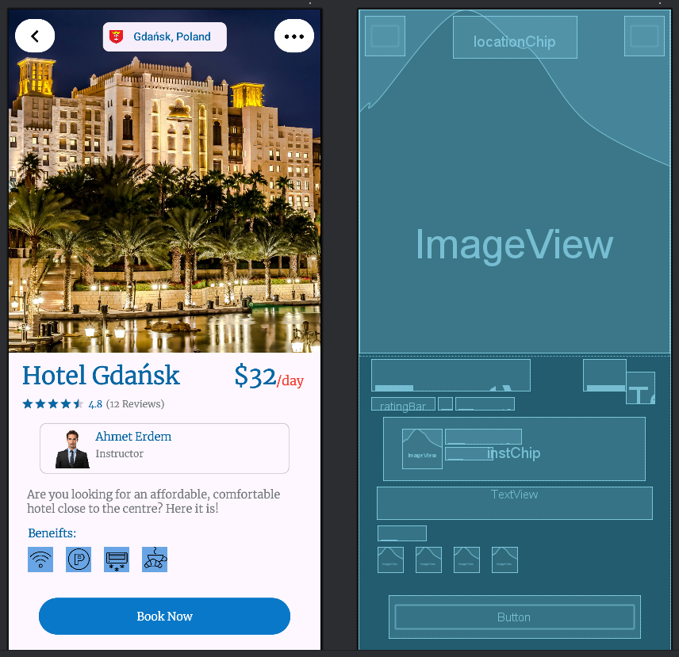

🎨 Tasarım Ödevi – BookHotel
Bu repo, Android Bootcamp kapsamında hazırlanmış olan tasarım ödevimi içermektedir. Proje XML ve Android Studio kullanılarak oluşturulmuştur.

📌 Proje Hakkında
Bu projede amaç, XML kısmında uygulama yaparak sistemin dinamiklerine alışmaktır.

🛠️ Kullanılan Teknolojiler / Araçlar
[Android Studio / XML / Envato UI Kits]

📷 Ekran Görüntüleri

